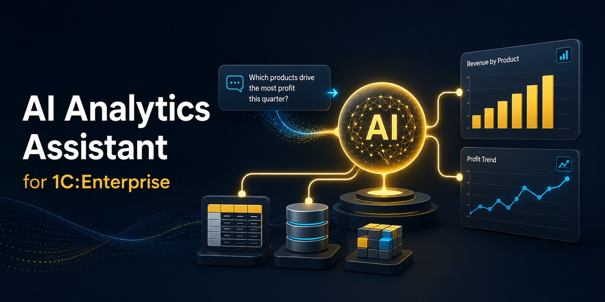
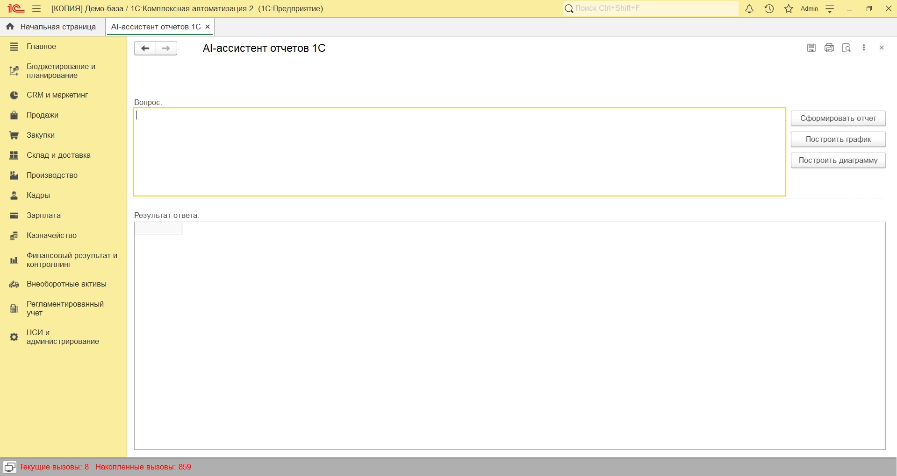
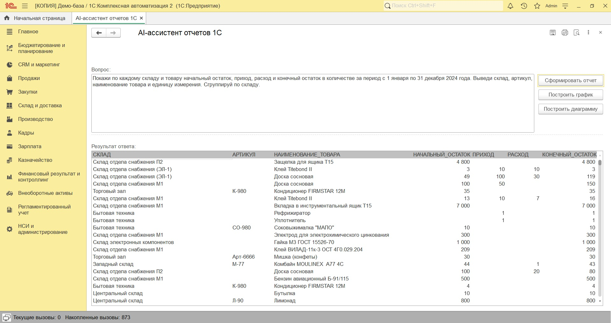
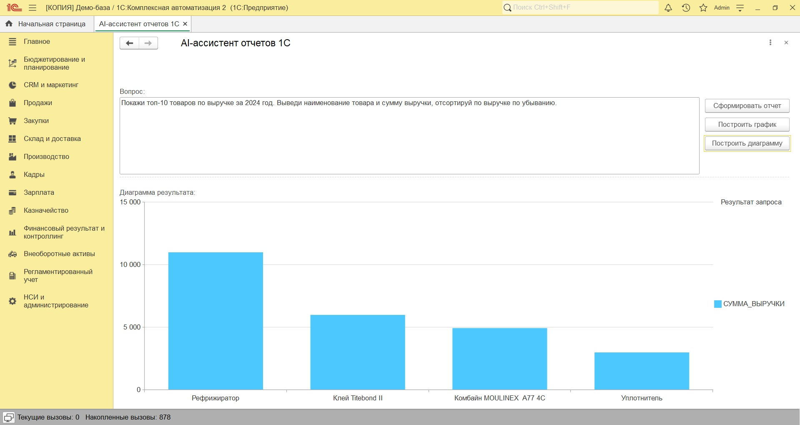
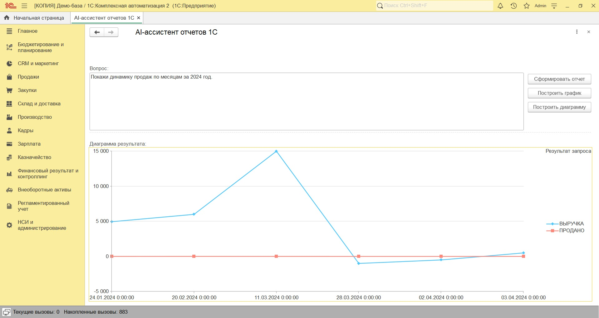
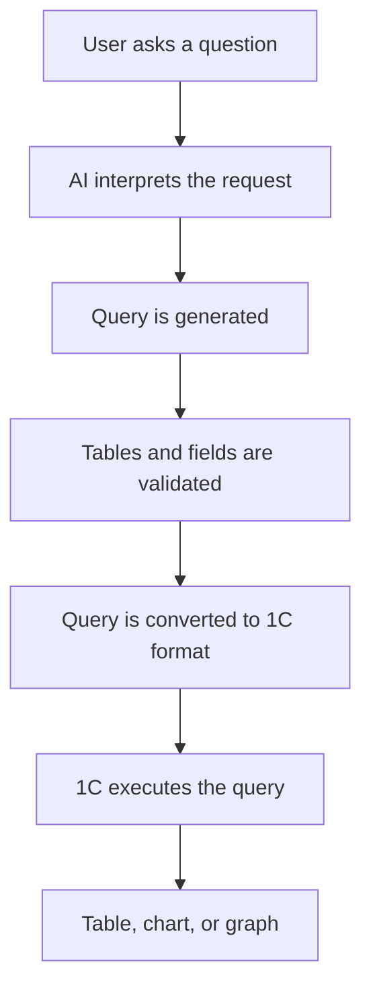

**English** | [Русский](README_RU.md)
# AI Analytics Assistant for 1C:Enterprise

An AI-powered analytics assistant that allows users to retrieve and visualize data from 1C:Enterprise using natural-language questions.

Instead of manually building reports or writing 1C queries, a user can describe the required information in plain language and receive the result as a table, chart, or graph.

> This repository is a public product showcase. The source code, processing file, AI instructions, and internal query-validation logic are not published.

## Overview

The assistant provides a simple interface between the user and analytical data stored in 1C:Enterprise.

Example questions:

* Show monthly sales for 2024.
* Show revenue by product.
* Display current warehouse stock.
* Show opening balance, receipts, consumption, and closing balance for 2024.
* Build a chart of sales by product.
* Show the revenue trend by month.

The assistant interprets the question, prepares an analytical query, validates it, executes it through the 1C query engine, and presents the result in a convenient format.

## Main Interface

The user enters a question in natural language and selects the preferred result presentation.

No knowledge of the 1C query language is required for everyday use.

## Result Formats

### Table

Suitable for detailed analysis, verification, filtering, and comparison of exact values.

### Chart

Suitable for comparing sales, revenue, stock, or other indicators across categories.

### Graph

Suitable for displaying trends and changes over time.

## Key Features

* Natural-language questions in the 1C interface.
* Automatic generation of analytical queries.
* Validation of requested tables and fields.
* Conversion into the 1C query language.
* Execution through standard 1C platform mechanisms.
* Results displayed as tables, charts, and graphs.
* Automatic retry when an invalid query is generated.
* Support for accumulation-register virtual tables.
* Controlled access to the available analytical data.
* Extensible architecture for adding new registers and fields.

## How It Works

The AI service is responsible for interpreting the question, while the actual data request is executed inside 1C:Enterprise.

The AI does not connect directly to the 1C database.

## Connected Data Registers

### Sales

Virtual table:

* `Sales.Turnovers`

Used to retrieve sales quantities and amounts for a selected period.

### Revenue and Cost of Sales

Virtual table:

* `RevenueAndCostOfSales.Turnovers`

Used to analyze:

* revenue;
* cost of sales;
* quantities sold;
* gross profit;
* sales performance by period, product, or other available dimensions.

### Goods in Warehouses

Virtual tables:

* `GoodsInWarehouses.Balances`;
* `GoodsInWarehouses.Turnovers`;
* `GoodsInWarehouses.BalancesAndTurnovers`.

Used to retrieve:

* current stock balances;
* opening balances;
* goods receipts;
* goods consumption;
* closing balances;
* warehouse turnover;
* product and warehouse-level analytics.

> The technical names above are translated for readability. Actual metadata names depend on the language and configuration of the 1C application.

## For Business Users

The assistant reduces the number of routine actions required to obtain analytical information.

A user does not need to:

* know the 1C query language;
* search through multiple standard reports;
* manually configure report fields and groupings;
* export data before performing a basic comparison.

The required result can be requested directly in plain language.

## For 1C Administrators

The solution is implemented as an external 1C processing tool and can be connected without publishing its source code in the application configuration.

Important architectural principles:

* analytical requests are executed by the 1C platform;
* the solution does not provide the AI service with direct database access;
* queries are executed within the current 1C user session;
* standard 1C access restrictions remain applicable;
* only approved data sources and fields can be used;
* the solution is intended for read-only analytical operations;
* available registers and fields can be extended centrally.

The final access level depends on the roles, RLS settings, and permissions configured for the current 1C user.

## For Developers

The processing tool uses a controlled request-processing pipeline:

1. The user submits a natural-language question.
2. The AI generates an intermediate SQL-like representation.
3. The request structure is normalized.
4. Tables, fields, and operations are validated.
5. The intermediate representation is converted into the 1C query language.
6. The query is executed by the 1C platform.
7. The result is converted into the selected presentation format.

The architecture separates:

* natural-language interpretation;
* query generation;
* security validation;
* 1C query execution;
* result visualization.

This makes it possible to add new registers and analytical scenarios without redesigning the user interface.

## Security Approach

The solution is designed around the following principles:

* no direct AI access to the database;
* no credentials stored in this public repository;
* no API keys included in the processing source;
* validation of allowed tables and fields;
* analytical read-only requests;
* execution under the current 1C user context;
* use of standard 1C access-control mechanisms.

The AI does not grant additional rights to a user. The user can only receive data that is available within their configured 1C permissions.

## Example Use Cases

* Sales analysis by month, product, manager, or customer.
* Revenue and cost comparison.
* Gross-profit analysis.
* Current warehouse-stock analysis.
* Opening and closing stock balance reports.
* Goods receipt and consumption analysis.
* Identification of negative stock balances.
* Data visualization for presentations and management reporting.

## Current Project Status

The project is currently under active development.

Implemented:

* natural-language request processing;
* analytical-query generation;
* query validation and conversion;
* execution of 1C queries;
* table output;
* chart output;
* graph output;
* support for the listed accumulation registers.

Planned improvements:

* additional registers and business areas;
* extended query diagnostics;
* more visualization options;
* configurable analytical access profiles;
* improved field-name presentation;
* reusable query templates.

## Demo Data

All screenshots and examples in this repository were created using a demonstration database.

They do not contain confidential information or real company data.

## Repository Scope

This public repository contains:

* product description;
* interface screenshots;
* supported analytical scenarios;
* architectural overview;
* current development status.

It does not contain:

* the `.epf` processing file;
* source code;
* API credentials;
* internal AI instructions;
* query-conversion algorithms;
* security-validation implementation.

## Author

Developed as an AI-assisted analytics solution for 1C:Enterprise.

For technical details, implementation discussions, or a product demonstration, please contact the repository owner.
