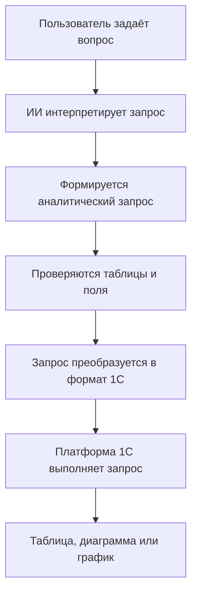

[English](README.md) | **Русский**

# ИИ-консультант для аналитики в 1С:Предприятии

ИИ-консультант позволяет получать и визуализировать аналитические данные из 1С с помощью вопросов на естественном языке.

Пользователю не требуется самостоятельно настраивать сложные отчёты или писать запросы 1С: достаточно описать нужную информацию обычными словами и выбрать способ представления результата — таблицу, диаграмму или график.

> Этот репозиторий является публичной витриной проекта. Исходный код, файл обработки, внутренние инструкции ИИ и алгоритмы проверки запросов не публикуются.

## О проекте

ИИ-консультант предоставляет простой интерфейс для работы с аналитическими данными, хранящимися в 1С:Предприятии.

Примеры вопросов:

* Покажи продажи по месяцам за 2024 год.
* Покажи выручку по номенклатуре.
* Покажи текущие остатки товаров на складах.
* Покажи начальный остаток, приход, расход и конечный остаток товаров за 2024 год.
* Построй диаграмму продаж по товарам.
* Покажи динамику выручки по месяцам.

Консультант интерпретирует вопрос, формирует аналитический запрос, проверяет его, выполняет средствами платформы 1С и выводит результат в удобном виде.

## Основной интерфейс

Пользователь вводит вопрос обычным языком и выбирает необходимый вариант представления результата.

Для повседневной работы знание языка запросов 1С не требуется.

## Варианты представления результата

### Таблица

Подходит для подробного анализа, проверки и сравнения точных значений.

### Диаграмма

Подходит для визуального сравнения продаж, выручки, складских остатков и других показателей.

### График

Подходит для отображения динамики показателей и их изменения во времени.

## Основные возможности

* Ввод вопросов на естественном языке непосредственно в интерфейсе 1С.
* Автоматическое формирование аналитических запросов.
* Проверка запрашиваемых таблиц и полей.
* Преобразование запроса в язык запросов 1С.
* Выполнение запроса стандартными средствами платформы.
* Вывод результата в виде таблицы, диаграммы или графика.
* Повторное формирование запроса при обнаружении ошибки.
* Поддержка виртуальных таблиц регистров накопления.
* Контролируемый доступ к аналитическим данным.
* Возможность подключения дополнительных регистров и полей.

## Принцип работы

ИИ-сервис используется для интерпретации вопроса пользователя, однако само получение данных выполняется внутри 1С:Предприятия.

ИИ не подключается напрямую к базе данных 1С.

## Подключённые регистры

### Регистр накопления «Продажи»

Используется виртуальная таблица:

* `Продажи.Обороты`.

Позволяет получать данные о количестве и сумме продаж за выбранный период.

### Регистр накопления «Выручка и себестоимость продаж»

Используется виртуальная таблица:

* `ВыручкаИСебестоимостьПродаж.Обороты`.

Позволяет анализировать:

* выручку;
* себестоимость;
* количество проданных товаров;
* валовую прибыль;
* показатели продаж по периодам, товарам и другим доступным разрезам.

### Регистр накопления «Товары на складах»

Подключены виртуальные таблицы:

* `ТоварыНаСкладах.Остатки`;
* `ТоварыНаСкладах.Обороты`;
* `ТоварыНаСкладах.ОстаткиИОбороты`.

Позволяют получать:

* текущие складские остатки;
* начальные остатки;
* поступление товаров;
* расход товаров;
* конечные остатки;
* складские обороты;
* данные в разрезе складов и номенклатуры.

Фактический состав доступных измерений, ресурсов и реквизитов зависит от используемой конфигурации 1С.

## Для обычного пользователя

ИИ-консультант сокращает количество действий, необходимых для получения аналитической информации.

Пользователю не требуется:

* знать язык запросов 1С;
* искать информацию в нескольких стандартных отчётах;
* вручную настраивать поля и группировки;
* выгружать данные для выполнения базового анализа.

Необходимую информацию можно запросить непосредственно на естественном языке.

## Для администратора 1С

Решение реализовано в виде внешней обработки 1С и может использоваться без публикации исходного кода в конфигурации.

Основные архитектурные принципы:

* аналитические запросы выполняются платформой 1С;
* ИИ-сервис не получает прямого доступа к базе данных;
* запрос выполняется в сеансе текущего пользователя;
* продолжают действовать стандартные ограничения доступа 1С;
* используются только разрешённые источники данных и поля;
* обработка предназначена для аналитического чтения данных;
* перечень доступных регистров и полей расширяется централизованно.

Фактический доступ к данным зависит от ролей, RLS и других прав, настроенных для текущего пользователя 1С.

## Для разработчика

Обработка использует контролируемую последовательность выполнения запроса:

1. Пользователь вводит вопрос на естественном языке.
2. ИИ формирует промежуточное SQL-подобное представление.
3. Структура запроса нормализуется.
4. Выполняется проверка таблиц, полей и операций.
5. Промежуточное представление преобразуется в язык запросов 1С.
6. Запрос выполняется платформой 1С.
7. Полученный результат передаётся в выбранный вариант визуализации.

В архитектуре разделены:

* интерпретация естественного языка;
* формирование запроса;
* проверка безопасности;
* выполнение запроса в 1С;
* визуализация результата.

Это позволяет подключать новые регистры и аналитические сценарии без полной переработки пользовательского интерфейса.

## Безопасность

Решение разрабатывается с учётом следующих принципов:

* отсутствие прямого доступа ИИ к базе данных;
* отсутствие ключей и паролей в публичном репозитории;
* проверка разрешённых таблиц и полей;
* использование только аналитических запросов на чтение;
* выполнение запросов в контексте текущего пользователя;
* использование стандартных механизмов контроля доступа 1С.

ИИ не предоставляет пользователю дополнительных прав. Пользователь может получить только те данные, которые доступны ему в соответствии с настроенными правами 1С.

## Примеры применения

* Анализ продаж по месяцам, товарам, менеджерам и клиентам.
* Сравнение выручки и себестоимости.
* Анализ валовой прибыли.
* Контроль текущих складских остатков.
* Анализ начальных и конечных остатков.
* Анализ поступления и расхода товаров.
* Поиск отрицательных складских остатков.
* Подготовка визуальных данных для презентаций и управленческой отчётности.

## Текущий статус проекта

Проект находится в активной разработке.

На текущий момент реализованы:

* обработка вопросов на естественном языке;
* формирование аналитических запросов;
* проверка и преобразование запросов;
* выполнение запросов средствами 1С;
* табличное представление результата;
* отображение диаграмм;
* отображение графиков;
* работа с перечисленными регистрами накопления.

Планируемые улучшения:

* подключение дополнительных регистров и разделов учёта;
* расширенная диагностика запросов;
* дополнительные варианты визуализации;
* настройка аналитических профилей доступа;
* улучшение представления названий полей;
* библиотека готовых шаблонов вопросов.

## Демонстрационные данные

Все скриншоты и примеры в репозитории сформированы на демонстрационной информационной базе.

Они не содержат конфиденциальных сведений или реальных данных компаний.

## Содержимое репозитория

В публичном репозитории размещены:

* описание продукта;
* скриншоты интерфейса;
* примеры аналитических сценариев;
* общее описание архитектуры;
* информация о текущем состоянии проекта.

В репозитории отсутствуют:

* файл обработки `.epf`;
* исходный код;
* API-ключи и параметры подключения;
* внутренние инструкции для ИИ;
* алгоритмы преобразования запросов;
* реализация механизмов проверки безопасности.

## Автор

Проект разработан как интеллектуальное решение для получения и визуализации аналитических данных в 1С:Предприятии.

По вопросам технической реализации или демонстрации решения можно связаться с владельцем репозитория.
